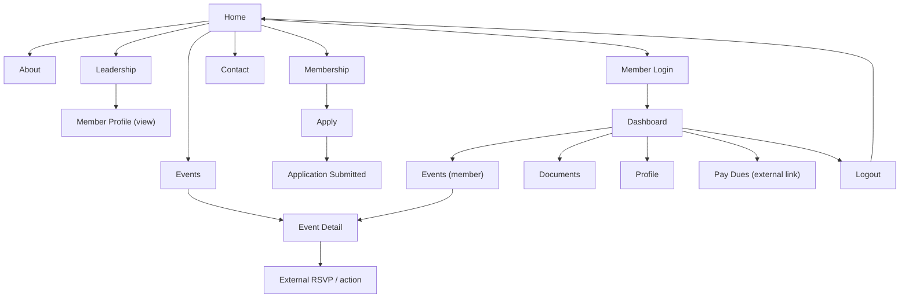
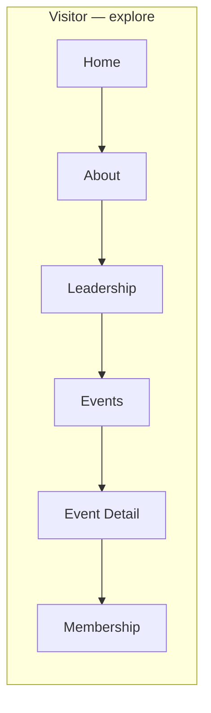
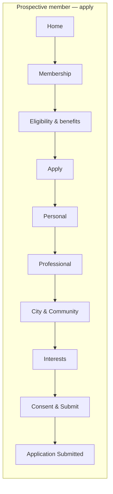
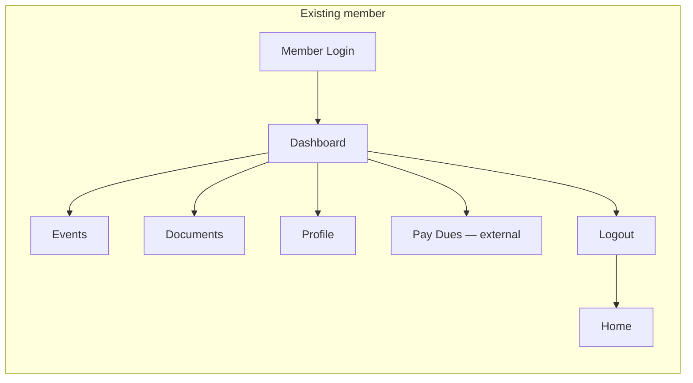
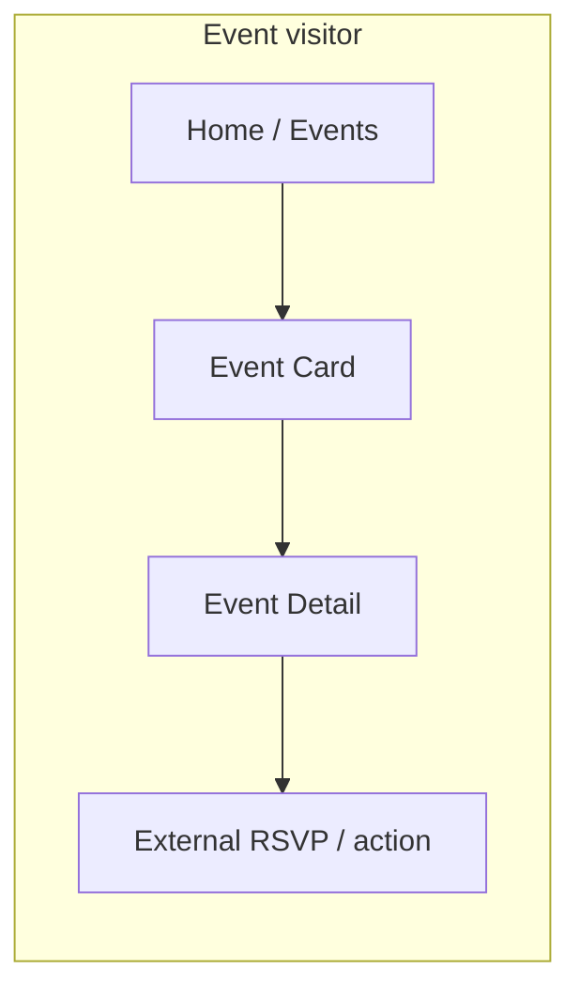

# MYPC Wireframes — Delivery / Status

**Figma file:** https://www.figma.com/design/pVO4bLo6LT67AnRDP33t2x/MYPC-%E2%80%94-Website-%2B-Member-Portal-(Wireframes)
File key: `pVO4bLo6LT67AnRDP33t2x`

**Fidelity:** low — grayscale, boxes, placeholder copy/imagery. Structure only, no visual style.
**Last updated:** 2026-09-02

---

## ⚠️ Blocked — Figma Starter plan MCP limit reached

The Figma account (`william.glewis17@gmail.com`, *William G. Lewis's Team*, **Starter** tier)
allows **20 Figma MCP tool calls per month**. That budget is now exhausted, so no further
edits to the Figma file can be made this session.

To finish the remaining items (below) I need one of:
- the monthly allowance to reset, **or**
- an upgrade to a **Professional** plan with a **Full or Dev seat** (200 calls/day).

Everything already in the file is saved and editable in Figma right now.

---

## Built and in the file

### Pages (3 — Starter plan caps pages at 3, so sections group the six planned areas)
| Page | Holds |
|------|-------|
| `00–02 · Overview — Cover / IA / Flows` | *empty — pending* |
| `03 + 05 · Desktop Wireframes & Components` | Components section + all 16 desktop screens |
| `04 + 06 · Mobile Wireframes & Prototype Map` | 3 of 9 mobile screens |

### 05 — Components (11, auto-layout) ✅ verified
Header / Public · Header / Member · Footer (with DEMO/CONCEPT notice) · Button / Primary ·
Button / Secondary · Section Header · Field / Text · Image Placeholder · Card / Event ·
Card / Member · Row / Document

### 03 — Desktop wireframes (16) ✅ built · Home + Dashboard visually verified · all 16 confirmed present
D01 Home · D02 About · D03 Leadership · D04 Leadership — Member Profile (overlay) ·
D05 Events · D06 Event Detail · D07 Membership · D08 Apply — Application (5 sections) ·
D09 Application Submitted · D10 Contact · D11 Member Login · D12 Member Dashboard ·
D13 Member — Events · D14 Member — Documents · D15 Member — Profile · D16 Pay Dues (leaving site)

### 04 — Mobile wireframes (3 of 9) ⚠️ created (Figma API-confirmed), visual QA pending
M01 Mobile Nav (full-screen sheet) · M02 Home · M03 Events

---

## Not yet built (remaining work)

| Area | Items |
|------|-------|
| Mobile | Membership · Application · Login · Dashboard · Documents · Leadership directory (6 screens) |
| 00 Cover / Notes | project title card, legend, demo disclaimer, how-to-review note |
| 01 Information Architecture | site-map diagram (content ready below) |
| 02 User Flows | 4 flow diagrams (content ready below) |
| 06 Prototype Map | overview of wired connections |
| **Prototype** | **no reactions wired yet** — clickable flows still to do (list in WIREFRAME-SPEC §6) |

---

## Information Architecture (ready to draw — Mermaid source)

## User Flows (ready to draw — Mermaid source)

---

## Decisions needed before visual design — see WIREFRAME-SPEC and the list in the chat response.
